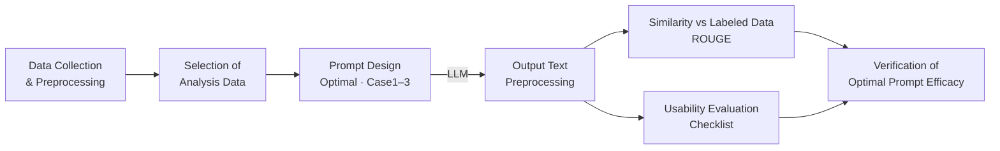
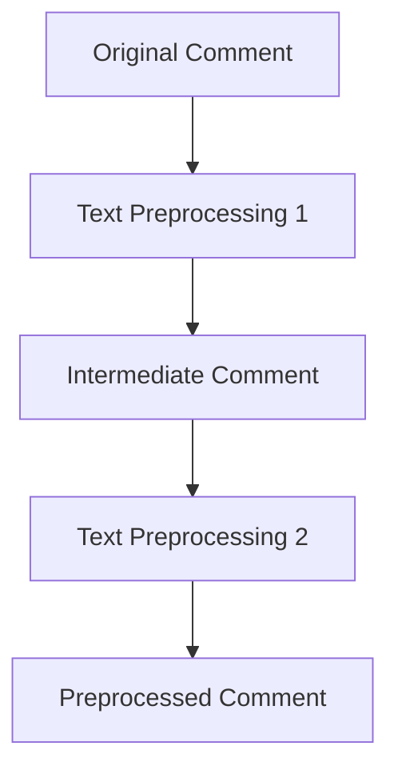
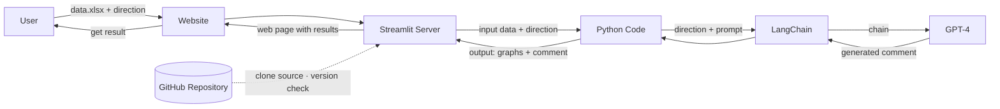
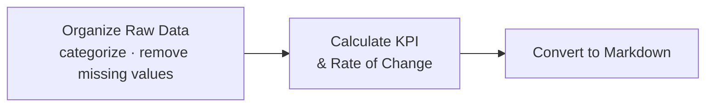
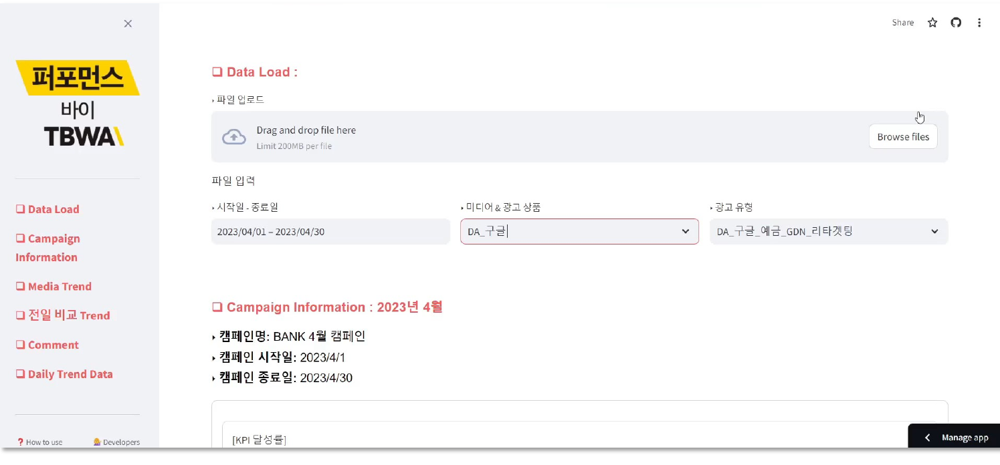
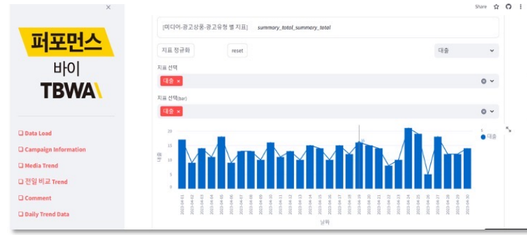
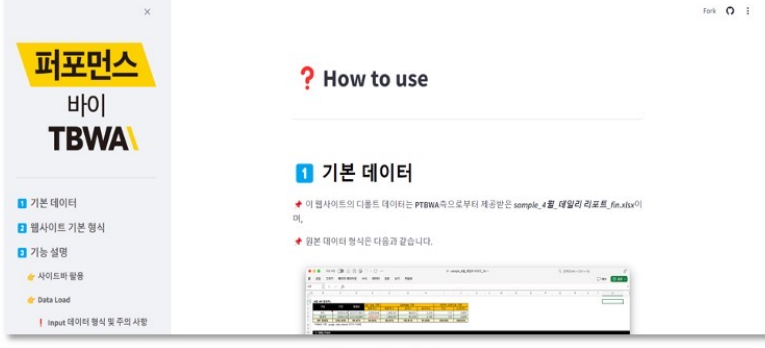

# 📊 Performance Marketing Report Comment Generator

> **Prompt Engineering for Business Data Analysis Using Generative AI Models — Focused on Performance Marketing Cases**

<p>
  
  
  
  
</p>

A capstone project that automates the most time-consuming part of a performance marketer's day: writing **daily report comments**. The tool ingests raw daily KPI data, designs a **Table-to-Text** prompt, and uses a GPT-4 model to generate consistent, report-ready comments — delivered through a Streamlit dashboard.

**🔗 Demo:** [comment-generate-dashboard.streamlit.app](https://comment-generate-dashboard.streamlit.app/) — *hosted on Streamlit Community Cloud, so the app sleeps after inactivity and may be slow to wake or temporarily unavailable. See the [screenshots](#screenshots) below.*

> **Effect:** daily reporting reduced from roughly **1 hr 30 min → 20 min** per advertiser, with less fatigue and more consistent output.

---

## 📑 Table of Contents

- [Background & Goal](#-background--goal)
- [Prompt Engineering](#-prompt-engineering)
- [Prompt Evaluation](#-prompt-evaluation)
- [Website](#-website)

---

## 🎯 Background & Goal

### The Problem — Manual Daily Reporting

In performance marketing, daily reports are produced by hand every day. The typical workflow looks like this:

1. **Download media data** (Google, Naver, …) — for a daily report, pull the previous day's data.
2. **Download MMP data** (GA, AppsFlyer, Adjust, …) — again, the previous day.
3. **Pre-process** the data in Excel, using **different criteria for each advertiser**.
4. **Join** the media and MMP data into a single RAW dataset.
5. **Update** the report sheets (pivot-table refresh), then **write operational issues / notable points** and share with advertisers.

A marketer spends **roughly 1–1.5 hours per advertiser, every day** on this — heavily time- and energy-consuming, especially the final step of manually writing comments.

### Problem Definition

| Pain point | Description |
|---|---|
| ⏳ Time & labor | Manual reporting takes a lot of time and effort. |
| 🧩 Individual interpretation | Comments depend on each marketer's subjective reading of the numbers. |
| 🤖 Room for AI | Efficiency and accuracy can be improved by applying generative AI. |
| 📭 Research gap | Little prior research exists on **Table-to-Text** prompt engineering for this domain. |

### Project Goal

> Propose **Table-to-Text prompt engineering techniques** based on real performance-marketing data, so an LLM can turn daily KPI tables into reliable report comments.

### Research Workflow



**Phases:** `Data Preprocessing` → `Generating Output through Prompt` → `Evaluating Prompt Performance`

---

## 🧩 Prompt Engineering

### What is Prompt Engineering?

> Intentionally crafting a prompt / input text to induce the desired response from a Natural Language Processing (NLP) model.

### Prompt Techniques Considered

| Technique | Idea | Example |
|---|---|---|
| **Zero-Shot** | Directs the model to perform a task with no examples. | *"Please translate '사과' from Korean to English."* |
| **Few-Shot** | Provides a few sample input–output pairs first. | Several `English → Korean` translation pairs, then a new sentence. |
| **Persona** | Assigns the model a fictional role. | *"You are a professional European tour guide who recommends historical places."* |
| **Condition Giving** | Sets specific conditions to shape the output. | *"Give me a story. It must start with the main character singing in the park on a rainy day."* |
| **Fukatsu Method** | Structurally specifies conditions (in Markdown) to induce output. | `# command / # constraints / # example / # input / # output` |

### Techniques Used

This project combines two techniques:

- **Fukatsu Method** — uses **Markdown formatting** to specify each block of conditions.
- **Persona Method** — assigns the LLM the **role of an expert** marketer for the task.

```text
# Guideline: → Including Persona
You are a (). Please print out () based on the following constraints and input.

# Constraints:
- [Specific Constraint 1]
- [Specific Constraint 2]

# Input Statement:

# Output: → Set ChatGPT to generate content
```

### Optimal Prompt Structure

The final ("Optimal") prompt, in Markdown blocks:

```text
#데이터:

#운영사항:

#명령(페르소나 포함):
너는 10년 경력의 퍼포먼스 마케터야. 광고 캠페인의 효율성을 분석하고, 성과 데이터를 통해
인사이트를 도출하는 데 능숙해. 지표들 간의 연관성을 분석해, 광고 비용 관련 지표의 변동
원인을 명확히 설명할 수 있어. 광고 캠페인의 일일 성과 및 지표 변화에 대해 분석하고, 이를
기반으로 한 데일리 리포트 코멘트를 작성하려고 해. 변화율이 감소한 지표에 대해서만 코멘트를
작성할 거야. 캠페인 운영 사항, 제약조건, 규칙사항, 출력문 형식을 잘 지켜서 작성해줘.
분석 결과는 광고주인 [BANK]에게 제공될 예정이야.

#비용 관련 지표:
CPC, CPS, CPU, 신규방문CPU, 접수CPA, 심사CPA, 승인CPA, CPA, 예금CPA, 대출CPA

#출력문 규칙 사항:
- 지표들 간의 연관관계 분석을 통해 위에서 언급한 비용관련지표의 전일 대비 변화율이
  -3% 이상 적어진 지표와 그 단가에 어떤 영향을 미쳤는지 작성한다.
- 변화율이 -3% 이상 적어진 #비용 관련 지표만 코멘트를 작성한다.
- 운영 사항의 변화가 -3% 이상 적어진 #비용 관련 지표에 어떤 영향을 미쳤는지 작성한다.
- -3% 이상 적어진 지표가 없다면 가장 많이 변화한 #비용 관련 지표에 대해서 알려준다.

#제약조건:
- 리포트에 적합한 단어를 사용하고 개조식 문장을 사용하여 간단히 작성한다.
- 출력문 형식만 출력한다.
- 각 항목을 한 문장으로 요약하고, 이를 불렛 형태로 나열한다.

#출력문
[캠페인명 – 매체명]
-
-
```

### Example Output

```text
[Google SA 캠페인 – BANK]
- CPA: 전일 대비 27.78% 감소; 전반적인 광고 효율 개선을 반영하나, 접수·승인 수의 감소로 전체 효율성 증가.
- 예금CPA: 전일 대비 3.71% 감소; 예금 관련 전환 수 유지에도 불구하고 광고 비용이 낮아진 효과.
- 대출CPA: 전일 대비 35.80% 감소; 대출 전환 수 증가 및 관련 광고비 감소가 크게 기여.
```

### Prompt Variants (for comparison)

Two condition types are used to build the variants:

- **ECG** — *Essential Condition Giving*: required rules (e.g. only comment on cost metrics that changed by −3% or more).
- **ACG** — *Additional Condition Giving*: extra refinements (handling when no metric crosses the threshold, formatting, one-sentence bullets, etc.).

| Variant | Composition |
|---|---|
| **Optimal** | Fukatsu + Persona + Command + ECG + ACG |
| Case 1 | Persona + Command + ECG + ACG |
| Case 2 | Persona + Command + ECG + Example |
| Case 3 | Persona + Command + ECG + ACG + Example |

---

## 📈 Prompt Evaluation

Two complementary methods were used: a **quantitative** similarity metric (ROUGE) and a **qualitative** usability checklist.

### 1. ROUGE Score *(Recall-Oriented Understudy for Gisting Evaluation)*

Measures n-gram overlap between the generated comment and a reference ("labeled") comment.

- **ROUGE-1** — unigram overlap · **ROUGE-2** — bigram overlap · **ROUGE-L** — longest common subsequence
- **Recall** = matching grams ÷ grams in the reference
- **Precision** = matching grams ÷ grams in the generated text

> *Example* — generated `"the hello a cat dog fox jumps"` vs reference `"the fox jumps"` → recall `3/3 = 100%`, precision `3/7 = 43%`.

#### Comment Text Preprocessing (before scoring)



- **Preprocessing 1:** delete stopwords → delete punctuation (keep `%` and decimal points) → tokenize → remove noun spacing.
- **Preprocessing 2:** drop everything except *index / percent / decrease / increase* → normalize all increase/decrease wording to `decrease` / `increase` → reorder to `index + percent + increase/decrease`.

#### ROUGE Results — F1-Score *(higher is better)*

| Prompt | ROUGE-1 | ROUGE-2 | ROUGE-L |
|---|:--:|:--:|:--:|
| **Optimal** | **0.77** | **0.72** | **0.77** |
| Case 1 | 0.63 | 0.56 | 0.63 |
| Case 2 | 0.68 | 0.63 | 0.68 |
| Case 3 | 0.65 | 0.58 | 0.65 |

> **Optimal** scores highest across all three ROUGE variants — best word choice, phrasing, and structural consistency vs. the reference.

### 2. Checklist (Qualitative)

| Evaluation area | Weight | Items |
|---|:--:|:--:|
| Comment accuracy | 20% | 4 |
| Analytical skill in evaluation | 30% | 5 |
| Language fluency | 20% | 4 |
| Usability | 30% | 5 |

- **Subject:** four prompts (Optimal, Case 1–3) for a single campaign on one date.
- **Evaluator:** one individual applying consistent criteria — **blind test**.
- **Scale:** binary (Yes = 1, No = 0), scored out of **100**.

#### Checklist Results *(average score / 100)*

| Prompt | Score |
|---|:--:|
| **Optimal** | **89.8** |
| Case 1 | 82.0 |
| Case 3 | 82.9 |
| Case 2 | 73.8 |

> **Optimal** again leads, performing best on accuracy, analytical depth, fluency, and usability.

---

## 🌐 Website

### Architecture & Workflow



The user uploads an `.xlsx` file and a direction; Streamlit passes it to the Python code, which builds the prompt, runs it through **LangChain → GPT-4**, and returns graphs and a generated comment to the web page. The Streamlit server pulls source from the **GitHub repository**.

### Data Preprocessing Process



All preprocessing runs in **Python**: raw data is organized and cleaned, KPIs and day-over-day rates of change are computed, and the table is converted to **Markdown** so it can be fed into the prompt.

### Screenshots

> The deployed app runs on Streamlit Community Cloud and **sleeps after a period of inactivity** — it may be slow to load or temporarily unavailable. The screenshots below show the dashboard in use.

**Data Load** — upload an `.xlsx` file and select the date range, media / ad product, and ad type.



**Trend** — per-metric daily trend charts for the selected campaign.



**How to Use** — built-in guide covering the expected data format and features.



> App URL (may be asleep): https://comment-generate-dashboard.streamlit.app/
> The dashboard sections include Data Load, Campaign Information, Media Trend, Day-over-Day Comparison, Comment, and Daily Trend Data.

---

<sub>Sections covered: Background &amp; Goal · Prompt Engineering · Prompt Evaluation · Website.</sub>
